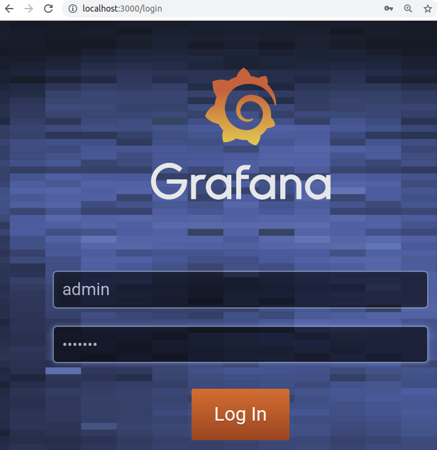
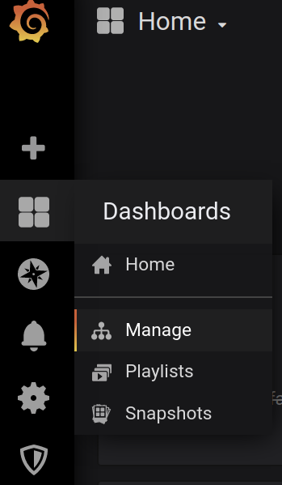
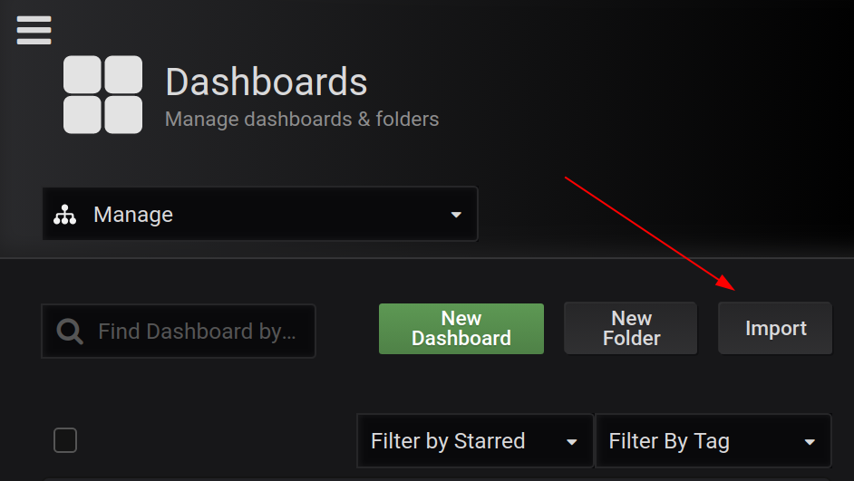
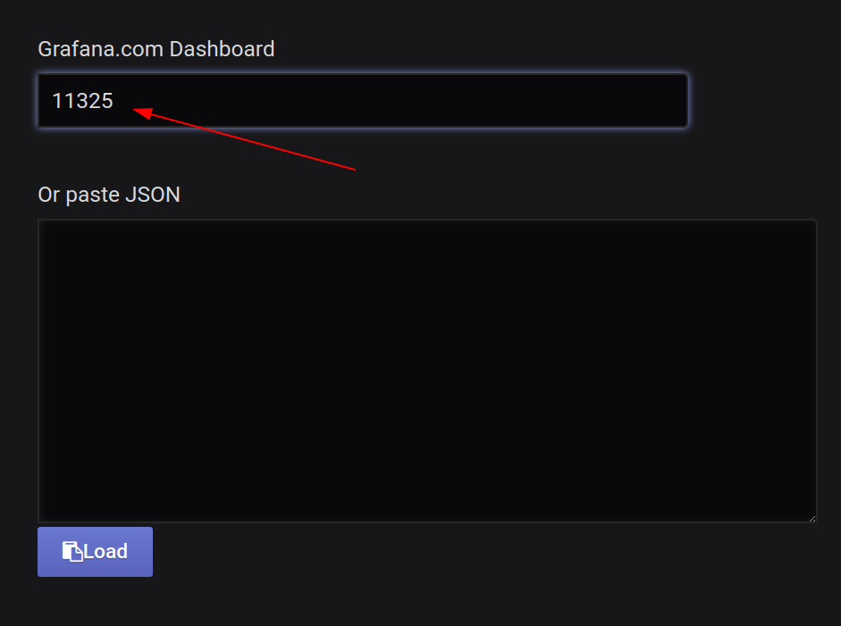
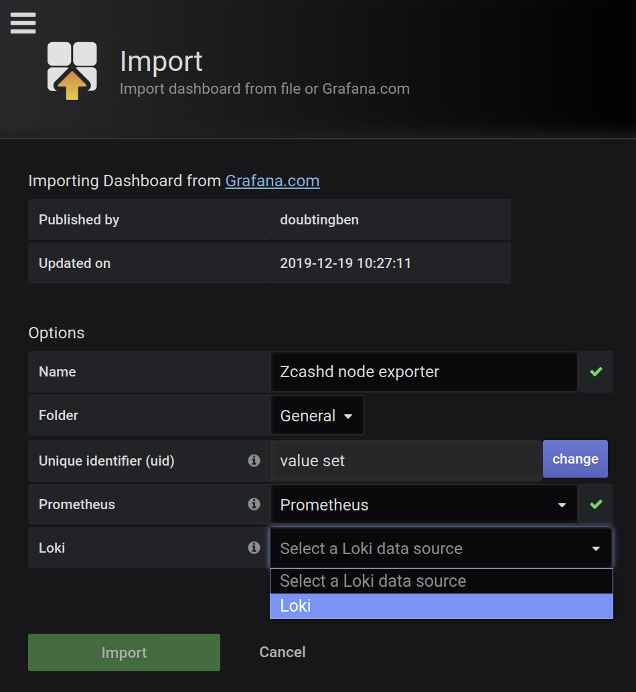
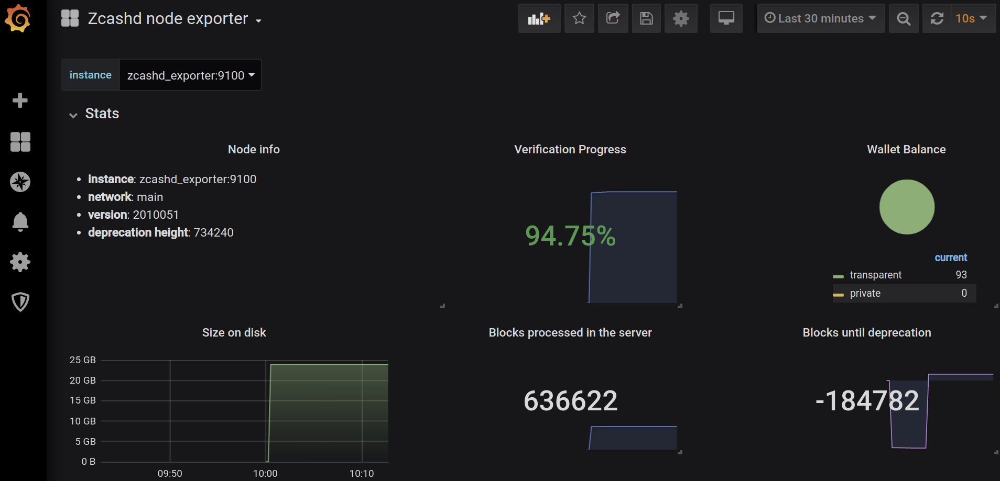
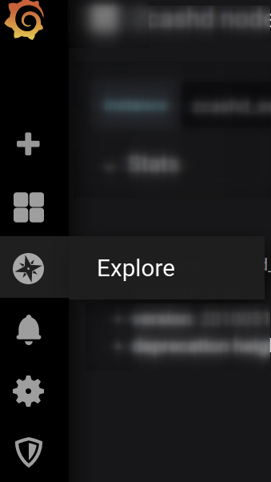
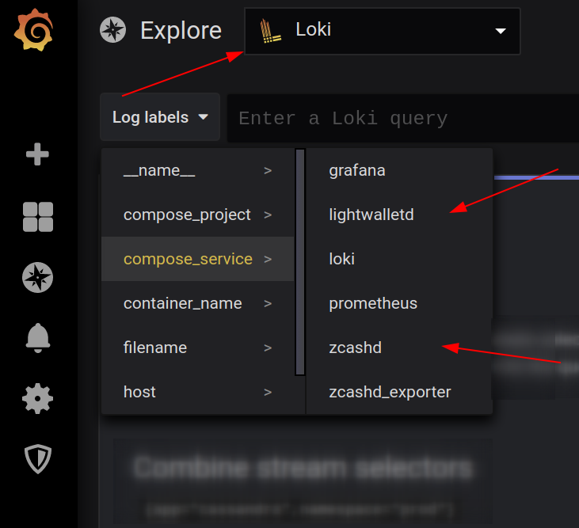
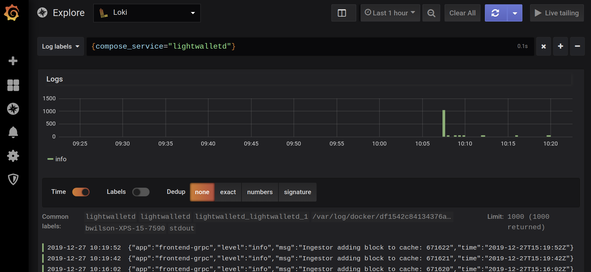
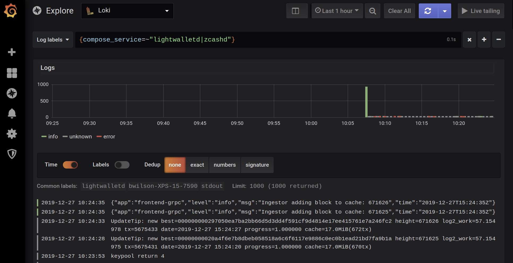

# Installation and setup

## Install requirements
- [docker](https://docs.docker.com/install/)  
- [docker-compose](https://docs.docker.com/compose/install/)
- loki plugin for docker logs
```
docker plugin install grafana/loki-docker-driver:latest --alias loki --grant-all-permissions
```

## Setup .env file

Copy `.env.example` to `.env` and change any required paramaters.

| Variable        | Usage           | 
| ------------- |:-------------:|
|   `GF_SECURITY_ADMIN_USER`   |    Grafana admin user name   |
|   `ZCASHD_RPCUSER`   |    zcashd rpc user   |
|   `ZCASHD_RPCPORT`   |    zcashd rpc port   |
|`ZCASHD_ALLOWIP`| zcashd rpc allowed IPs (don't |change unless you know what you're doing)|
|`ZCASHD_DATADIR`| local location of zcashd data directory. `uid` 2001 needs write access|
|`ZCASHD_PARMDIR`| local location of zcashd data directory. `uid` 2001 needs read access|
|`ZCASHD_NETWORK`| zcashd network to use, `testnet` or `mainnet`|
|`ZCASHD_GEN`| should zcashd mine? `0` or `1`
|`LWD_PORT`| port for lightwalletd to bind to|
|`ZCASHD_CONF_PATH`| path for lightwalletd to pick up configuration|


## Populate secret env vars with random values

```
./buildenv.sh | tee .env
```

## Build initial local docker image

`docker-compose build`

## Start the project

```
docker-compose up -d
```

# Setup and use Grafana

Open a browser to http://localhost:3000




Login with the user (`GF_SECURITY_ADMIN_USER`) and password (`GF_SECURITY_ADMIN_PASSWORD`).  
The values can be found in your `.env` file

Open the `Dashboard Manage` menu on the left

 

Select `Import`



Enter `11325` for the `Grafana.com Dashboard`



On the next screen, select the `Prometheus` and `Loki` values (there should only be 1 to select)



Click `Import`


This should then be taken to the `Zcashd node exporter` dashboard.



If all goes as planned, the dashboard should start populating data from the container services.

If there are an issues, you can view all the `docker-compose` services under the `Explore` section.

# Viewing container logs

Open the `Explore` menu entry



Make sure `Loki` is selected as the datasource at the top.



Then choose the container to view it's logs.



Loki as a rich query syntax to help with log in many ways, for example combine 2 container logs entries:



See more here: https://github.com/grafana/loki/blob/master/docs/logql.md
